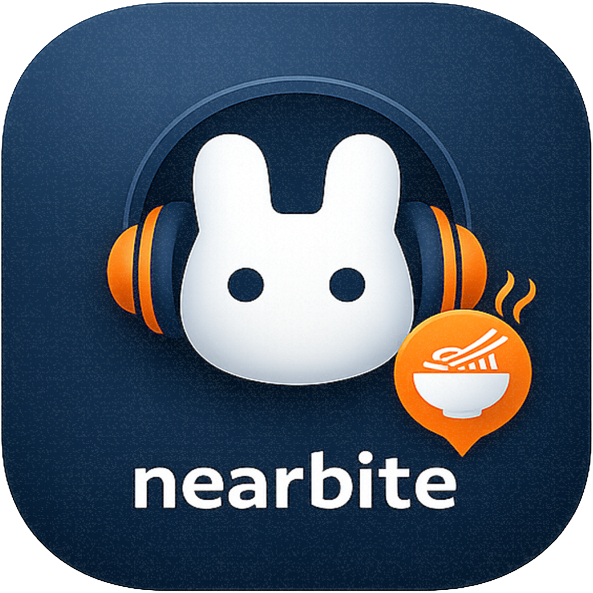
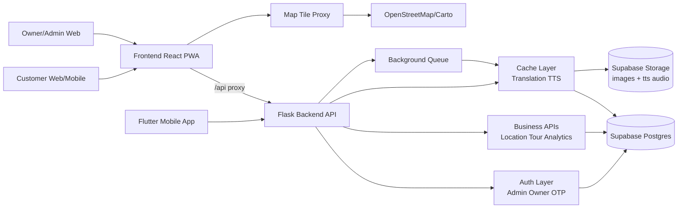

# NearBite

Location-aware food discovery platform with realtime narration, analytics, and multi-role management.

Nền tảng tìm quán ăn theo vị trí thời gian thực, có thuyết minh âm thanh, analytics, và quản trị theo vai trò.


## Visual Preview

<p align="center">
  
</p>

## Portfolio Snapshot

### VI
- 3 vai trò: Customer, Owner, Admin
- Customer OTP login + theo dõi GPS + nghe TTS thuyết minh quán gần nhất
- Owner/Admin dashboard CRUD đầy đủ: quán, menu, tag, hình ảnh
- Hệ thống cache Translation + TTS có prewarm, cleanup, và invalidate theo scope

### EN
- 3 roles: Customer, Owner, Admin
- Customer OTP login + GPS tracking + nearest-restaurant TTS narration
- Full Owner/Admin CRUD dashboards: restaurants, menu, tags, images
- Translation + TTS cache layer with prewarm, cleanup, and scoped invalidation

## Architecture Diagram



## Monorepo Structure

```text
seminar/
  backend/    Flask + SQLAlchemy + Supabase + Cache/TTS/Queue
  frontend/   React + Vite + Leaflet + API Proxy
  mobile/     Flutter app (Customer + Owner)
```

## Features (Portfolio Table)

| Feature | Mô tả (VI) | Description (EN) | Tech |
|---|---|---|---|
| Multi-role Authentication | 3 luồng đăng nhập riêng cho Admin, Owner, Customer (OTP) | Three dedicated auth flows for Admin, Owner, and Customer (OTP) | Flask Session, OTP Provider |
| Realtime Location Tracking | Theo dõi vị trí và xác định quán gần nhất theo bán kính POI | Live location tracking with nearest restaurant detection via POI radius | Geolocation, Heartbeat API |
| AI-like Narration + TTS | Sinh nội dung thuyết minh đa ngôn ngữ và phát audio tự động | Multi-language narration generation with auto audio playback | deep-translator, gTTS |
| Admin/Owner CMS | Quản lý quán, menu, tag, ảnh, tài khoản và trạng thái hoạt động | Manage restaurants, menu, tags, images, accounts, and active status | React Dashboard + Flask CRUD |
| Analytics & Heatmap | Thống kê người dùng online, top quán, heatmap vị trí | Online users, top restaurants, and location heatmap analytics | SQL + Tracking Endpoints |
| Smart Cache Layer | Cache Translation/TTS có TTL, prewarm, cleanup định kỳ | Translation/TTS cache with TTL, startup prewarm, periodic cleanup | Supabase Postgres + Storage |

## Quick Start (Windows)

### VI
Chạy nhanh backend + frontend:

```powershell
pwsh ./run-local.ps1
```

Backend: http://127.0.0.1:5000  
Frontend: http://localhost:3000

### EN
Fast boot backend + frontend:

```powershell
pwsh ./run-local.ps1
```

Backend: http://127.0.0.1:5000  
Frontend: http://localhost:3000

## Manual Run

### Backend

```powershell
cd backend
py -m venv .venv
.\.venv\Scripts\Activate.ps1
pip install -r requirements.txt
python app.py
```

### Frontend

```powershell
cd frontend
npm install
npm run dev
```

### Mobile

```powershell
cd mobile
pwsh ./run-android.ps1
```

## Environment Variables

### Backend (.env)

```env
SECRET_KEY=your-strong-secret
DATABASE_URL=postgresql://...
SUPABASE_URL=https://xxx.supabase.co
SUPABASE_SERVICE_KEY=your-service-role-key
ADMIN_PASSWORD=your-admin-password

# Optional but recommended
CORS_ALLOWED_ORIGINS=https://your-frontend-domain.com
OTP_EMAIL_PROVIDER=auto
RESEND_API_KEY=
RESEND_FROM_EMAIL=
CACHE_CLEANUP_ENABLED=true
PREWARM_TRANSLATIONS=true
PREWARM_RESTAURANTS=true
```

### Frontend (.env.local)

```env
VITE_API_PROXY_TARGET=http://127.0.0.1:5000
VITE_BASE_URL=https://your-backend-domain
VITE_FORCE_SAME_ORIGIN_API=true
BACKEND_BASE_URL=https://your-backend-domain
```

### Mobile (.env)

```env
API_BASE_URL=https://your-backend-domain
```

## Core API Groups

- Auth: `/admin/*`, `/owner/*`, `/customer/*`
- Customer: `/heartbeat`, `/languages`, `/restaurants`, `/tags`, `/location`, `/plan-tour`
- Tracking: `/track-location`, `/track-audio`
- Admin/Owner CRUD: `/admin/restaurants`, `/admin/menu`, `/admin/tags`, `/admin/images`
- Analytics: `/admin/restaurants/analytics`, `/admin/restaurants/top`, `/admin/heatmap`, `/admin/online-users`

## Deploy

### VI
- Backend: Railway hoặc Render (đã có `railway.toml`, `render.yaml`, `Procfile`)
- Frontend: Vercel hoặc Netlify (đã có `vercel.json`, `netlify.toml`)
- Nhớ set đầy đủ env vars trên dashboard deploy

### EN
- Backend: Railway or Render (ready with `railway.toml`, `render.yaml`, `Procfile`)
- Frontend: Vercel or Netlify (ready with `vercel.json`, `netlify.toml`)
- Ensure all environment variables are configured in deployment dashboards

## Notes

### VI
- Sau khi thêm route Flask mới, cần restart backend
- Không lưu cache/audio dài hạn trên local disk container (ephemeral)
- Nên dùng Supabase Storage cho image + TTS audio

### EN
- Restart backend after adding new Flask routes
- Avoid long-term local file storage in containers (ephemeral FS)
- Use Supabase Storage for persistent images and TTS audio
